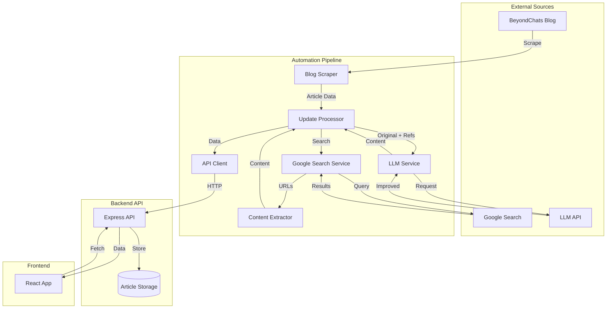

# BeyondChats Article Update Platform

A full-stack monorepo application for managing and improving blog articles through automated content updates. The system scrapes articles from BeyondChats, finds reference content via Google search, uses LLM to improve articles while preserving originals, and provides a React frontend for review.

The platform maintains a clear separation between original and updated content, tracks reference sources, and ensures all improvements are stored as new versions rather than overwriting originals. This design supports content audit trails and allows comparison between original and improved versions.

## Tech Stack

**Backend:**
- Node.js with Express for REST API
- In-memory data storage (easily replaceable with database)
- Custom validation and error handling

**Automation:**
- Node.js scripts for web scraping (Cheerio)
- Google Custom Search API integration
- LLM integration (OpenAI/Anthropic)
- Axios for HTTP requests

**Frontend:**
- React 18 with React Router
- Vite for build tooling
- Axios for API communication
- CSS modules for styling

**Development:**
- ES modules throughout
- Monorepo structure
- Environment-based configuration

## Local Setup

### Prerequisites

- Node.js 18+ and npm
- Google Custom Search API credentials (optional, has fallback)
- OpenAI or Anthropic API key (for LLM features)

### Step-by-Step Setup

1. **Clone and navigate to the project:**
   ```bash
   cd assignment-3
   ```

2. **Set up the API:**
   ```bash
   cd apps/api
   npm install
   ```
   
   Create `.env.local`:
   ```env
   PORT=3001
   NODE_ENV=development
   CORS_ORIGIN=http://localhost:3000
   ```
   
   Start the API:
   ```bash
   npm start
   ```
   The API runs on `http://localhost:3001`

3. **Set up automation scripts:**
   ```bash
   cd scripts/automation
   npm install
   ```
   
   Create `.env.local`:
   ```env
   # Google Search (optional - has web scraping fallback)
   GOOGLE_API_KEY=your-google-api-key
   GOOGLE_SEARCH_ENGINE_ID=your-search-engine-id
   
   # LLM Provider (choose one)
   OPENAI_API_KEY=your-openai-key
   # OR
   ANTHROPIC_API_KEY=your-anthropic-key
   LLM_PROVIDER=openai  # or 'anthropic'
   
   # API URL for storing articles
   API_URL=http://localhost:3001
   ```

4. **Set up the frontend:**
   ```bash
   cd apps/frontend
   npm install
   ```
   
   Create `.env.local`:
   ```env
   VITE_API_URL=http://localhost:3001
   ```
   
   Start the frontend:
   ```bash
   npm run dev
   ```
   The frontend runs on `http://localhost:3000`

### Quick Start

Once all services are running:

1. **Scrape articles from BeyondChats:**
   ```bash
   cd scripts/automation
   npm run scrape
   ```

2. **Run the full update pipeline:**
   ```bash
   npm run update
   ```
   This will scrape the 5 oldest articles, find references, improve them with LLM, and store them in the API.

3. **View articles in the frontend:**
   Open `http://localhost:3000` in your browser.

## Environment Variables

### API (`apps/api/.env.local`)

- `PORT` - API server port (default: 3001)
- `NODE_ENV` - Environment mode (development/production)
- `CORS_ORIGIN` - Allowed CORS origin (default: `*`)

### Automation (`scripts/automation/.env.local`)

- `GOOGLE_API_KEY` - Google Custom Search API key (optional)
- `GOOGLE_SEARCH_ENGINE_ID` - Google Search Engine ID (optional)
- `OPENAI_API_KEY` - OpenAI API key (if using OpenAI)
- `ANTHROPIC_API_KEY` - Anthropic API key (if using Anthropic)
- `LLM_PROVIDER` - LLM provider: `openai` or `anthropic` (default: `openai`)
- `API_URL` - Backend API URL (default: `http://localhost:3001`)

**Note:** If Google API credentials are missing, the system falls back to web scraping (less reliable). LLM credentials are required for article improvement features.

### Frontend (`apps/frontend/.env.local`)

- `VITE_API_URL` - Backend API URL (default: `http://localhost:3001`)

## Architecture & Data Flow

### System Architecture



See `docs/architecture.md` for detailed architecture documentation.

### Data Flow

1. **Scraping Phase:**
   - `blogScraper.js` fetches the 5 oldest articles from BeyondChats
   - Extracts title, URL, content, and publish date
   - Returns structured article data

2. **Reference Discovery:**
   - `googleSearch.js` searches Google for each article title
   - Filters results to find relevant blog/article pages
   - Excludes BeyondChats domain and non-article pages
   - Returns 2 reference articles per original

3. **Content Extraction:**
   - `articleContentExtractor.js` extracts clean content from reference URLs
   - Removes navigation, ads, and unrelated elements
   - Returns plain text suitable for LLM processing

4. **Article Improvement:**
   - `llmService.js` sends original article + references to LLM
   - LLM improves clarity, structure, and depth
   - Prompt designed to avoid plagiarism and hallucination
   - Returns improved content in original language

5. **Storage:**
   - `apiClient.js` calls REST API to store articles
   - Original articles stored with `type: 'original'`
   - Improved articles stored with `type: 'updated'` and linked via `originalArticleId`
   - Reference URLs saved in `citationUrls` array

6. **Review:**
   - Frontend fetches articles from API
   - Displays original and updated versions side-by-side
   - Shows reference sources and metadata

### Key Design Decisions

- **Immutable Originals:** Original content is never modified. Updates are stored as separate entries.
- **Reference Tracking:** All reference URLs are stored for transparency and audit purposes.
- **Idempotent Pipeline:** Running the pipeline multiple times won't create duplicates (checks for existing updates).
- **Separation of Concerns:** Each module has a single responsibility and can be tested independently.

## Automation Pipeline

The automation pipeline (`scripts/automation`) orchestrates the entire content update process.

### Available Commands

```bash
# Scrape 5 oldest articles from BeyondChats
npm run scrape

# Search Google for reference articles
npm run search "Article Title"

# Extract content from a URL
npm run extract "https://example.com/article"

# Run full update pipeline (scrape → search → improve → store)
npm run update

# Update specific article by ID
node src/index.js update <articleId>
```

### Pipeline Steps

When you run `npm run update`, the system:

1. **Scrapes BeyondChats:** Fetches the 5 oldest blog articles
2. **Ensures API Storage:** Creates original articles in the API if they don't exist
3. **For Each Article:**
   - Searches Google for 2 reference articles
   - Extracts clean content from references
   - Improves article using LLM with references as style guides
   - Checks if update already exists (idempotency)
   - Creates updated article entry in API with reference URLs

### Pipeline Output

The pipeline returns a summary:
```javascript
{
  total: 5,
  successful: 4,
  skipped: 1,    // Update already existed
  failed: 0,
  articles: [...] // Detailed results per article
}
```

### Error Handling

- Individual article failures don't stop the pipeline
- Network errors are retried where appropriate
- All errors are logged with context
- Failed articles are tracked in the output summary

## Frontend Usage

The React frontend provides a clean interface for reviewing articles.

### Features

- **Article List:** View all articles with filtering (All, Original, Updated)
- **Article Detail:** Full article view with tabs for original/updated content
- **Reference Display:** Shows all reference URLs used for improvements
- **Update Tracking:** View all updates for a given original article

### Navigation

- **Home (`/`):** Article list with filters
- **Article Detail (`/articles/:id`):** Full article view

### Article Cards

Each article card shows:
- Type badge (Original/Updated)
- Title and preview
- Creation date
- Reference count (for updated articles)
- Link to original (for updated articles)

### Article Detail View

The detail page includes:
- Full article content
- Tabs to switch between updated and original content
- Metadata (dates, source URL)
- Reference URLs section
- List of all updates (if viewing original article)

### Responsive Design

The frontend adapts to different screen sizes:
- Mobile: Single column layout
- Tablet: 2-column grid
- Desktop: 3-column grid

## API Endpoints

### Articles

- `GET /api/articles` - List articles (supports `?type=original|updated` filter)
- `GET /api/articles/:id` - Get single article
- `POST /api/articles` - Create new article
- `POST /api/articles/:id/updates` - Create updated version
- `GET /api/articles/:id/updates` - Get all updates for an article

See `docs/api.md` for complete API documentation.

## Development Notes

### Adding a Database

The API currently uses in-memory storage. To add a database:

1. Install your preferred ORM (Prisma, Sequelize, Mongoose)
2. Replace functions in `apps/api/src/models/article.js`
3. Update environment variables for database connection

### Extending the Pipeline

The pipeline is modular. To add new steps:

1. Create a new module in `scripts/automation/src/`
2. Import and use in `articleUpdateProcessor.js`
3. Follow existing error handling patterns

### Customizing LLM Prompts

Edit `scripts/automation/src/services/llmService.js` to modify the improvement prompt. See `scripts/automation/src/services/LLM_PROMPT_DESIGN.md` for prompt design rationale.

## Troubleshooting

**API not responding:**
- Check that the API is running on port 3001
- Verify CORS settings if accessing from different origin

**Google search failing:**
- Verify API credentials in `.env.local`
- System will fall back to web scraping if API unavailable

**LLM errors:**
- Check API key is set correctly
- Verify provider setting matches your key type
- Check API rate limits

**Frontend can't connect:**
- Verify `VITE_API_URL` matches your API URL
- Check browser console for CORS errors

## Live Demo

[Link to live demo will be added here]

---

**Note:** This is an internal tool for content review. All original articles are preserved, and updates are tracked with full reference attribution.

