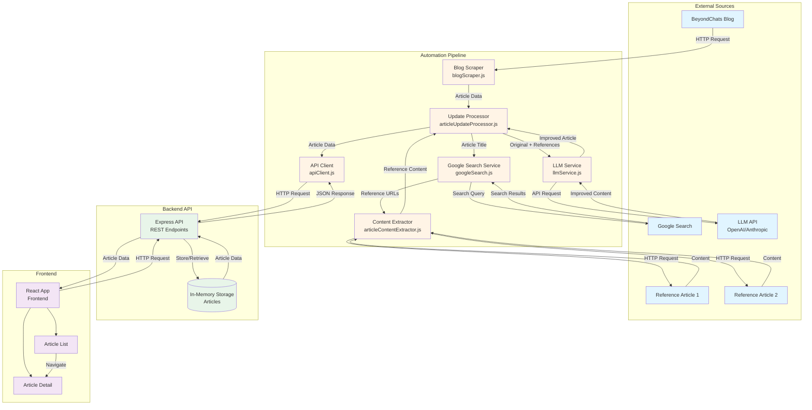

# Architecture & Data Flow

## System Overview

The platform consists of three main components: an automation pipeline, a REST API, and a React frontend. The automation pipeline orchestrates content scraping, reference discovery, and LLM-based improvement, while the API stores and manages articles. The frontend provides a review interface.

## Architecture Diagram



## Data Flow Sequence

### 1. Initial Scraping Phase
```
BeyondChats Blog → Blog Scraper → Article Data (title, URL, content, date)
```

The blog scraper fetches the 5 oldest articles from BeyondChats, extracts metadata and content, and returns structured data.

### 2. Reference Discovery Phase
```
Article Title → Google Search → Reference URLs → Content Extractor → Reference Content
```

For each article, the system searches Google for relevant reference articles, filters results to find valid blog/article pages, and extracts clean content from those references.

### 3. Article Improvement Phase
```
Original Article + Reference Content → LLM Service → LLM API → Improved Content
```

The LLM service sends the original article and reference content to the LLM with instructions to improve clarity and structure while avoiding plagiarism.

### 4. Storage Phase
```
Improved Article + Metadata → API Client → REST API → Storage
```

The improved article is stored via the REST API, linked to the original article, with reference URLs saved for traceability.

### 5. Review Phase
```
Frontend → REST API → Storage → Article Data → Frontend Display
```

The React frontend fetches articles from the API and displays them with options to view original and updated versions.

## Component Responsibilities

### Automation Pipeline

**Blog Scraper** (`blogScraper.js`)
- Fetches articles from BeyondChats blog
- Handles pagination
- Extracts article metadata and content
- Returns structured article data

**Google Search Service** (`googleSearch.js`)
- Searches Google for article references
- Filters results to find relevant blog/article pages
- Excludes BeyondChats domain and non-article pages
- Returns validated reference URLs

**Content Extractor** (`articleContentExtractor.js`)
- Fetches HTML from reference URLs
- Extracts main content using multiple strategies
- Removes navigation, ads, and noise
- Returns clean plain text

**LLM Service** (`llmService.js`)
- Constructs improvement prompts
- Calls LLM API (OpenAI or Anthropic)
- Handles API errors and retries
- Returns improved content

**Update Processor** (`articleUpdateProcessor.js`)
- Orchestrates the entire pipeline
- Manages article creation and updates
- Ensures idempotency
- Handles errors gracefully

**API Client** (`apiClient.js`)
- Provides clean interface to REST API
- Handles HTTP requests and responses
- Manages error handling
- Serializes/deserializes data

### Backend API

**REST API** (`server.js`, `routes/articles.js`)
- Provides CRUD endpoints for articles
- Validates requests
- Manages article storage
- Handles errors consistently

**Article Model** (`models/article.js`)
- Defines article schema
- Validates article data
- Manages in-memory storage
- Ensures original content immutability

### Frontend

**React App** (`App.jsx`)
- Main application component
- Sets up routing
- Manages overall layout

**Article List** (`ArticleList.jsx`)
- Displays all articles
- Provides filtering (All, Original, Updated)
- Handles loading and error states

**Article Detail** (`ArticleDetail.jsx`)
- Shows full article content
- Provides tabs for original/updated versions
- Displays reference URLs and metadata

**API Service** (`services/api.js`)
- Fetches data from REST API
- Handles errors
- Provides clean data interface

## Key Design Patterns

### Separation of Concerns
Each component has a single, well-defined responsibility. Scrapers handle extraction, services handle external APIs, processors orchestrate workflows.

### Idempotency
The pipeline can be run multiple times safely. It checks for existing updates before creating new ones, preventing duplicates.

### Immutability
Original articles are never modified. All updates are stored as separate entries with links to originals.

### Error Resilience
Individual component failures don't stop the entire pipeline. Errors are logged and tracked, allowing partial success.

### API-First Design
All components communicate through well-defined API interfaces, making the system modular and testable.

## Data Model

### Article Structure
```javascript
{
  id: number,
  title: string,
  url: string,
  originalContent: string,        // Immutable
  updatedContent: string | null,  // LLM-improved content
  type: 'original' | 'updated',
  citationUrls: string[],          // Reference URLs
  originalArticleId: number | null, // Link to original
  createdAt: string,
  updatedAt: string,
  originalPublishDate: string | null
}
```

### Relationships
- Original articles have `type: 'original'` and `originalArticleId: null`
- Updated articles have `type: 'updated'` and `originalArticleId: <original_id>`
- Multiple updates can link to the same original article

## ASCII Diagram (Alternative)

```
┌─────────────────┐
│ BeyondChats Blog│
└────────┬────────┘
         │ HTTP Request
         ▼
┌─────────────────┐
│  Blog Scraper    │
└────────┬────────┘
         │ Article Data
         ▼
┌─────────────────┐
│ Update Processor │
└────────┬────────┘
         │
         ├─────────────────┐
         │                 │
         ▼                 ▼
┌─────────────────┐  ┌─────────────────┐
│ Google Search    │  │ Content Extract │
└────────┬────────┘  └────────┬────────┘
         │                   │
         │ Search Results    │ Reference Content
         │                   │
         └─────────┬─────────┘
                   │
                   ▼
         ┌─────────────────┐
         │   LLM Service    │
         └────────┬────────┘
                   │
                   │ Improved Content
                   ▼
         ┌─────────────────┐
         │   API Client     │
         └────────┬────────┘
                   │
                   │ HTTP Request
                   ▼
         ┌─────────────────┐
         │   REST API       │
         └────────┬────────┘
                   │
                   │ Store/Retrieve
                   ▼
         ┌─────────────────┐
         │   Storage        │
         └────────┬────────┘
                   │
                   │ Article Data
                   ▼
         ┌─────────────────┐
         │  React Frontend  │
         └─────────────────┘
```

## Technology Stack Flow

```
Node.js Scripts (Automation)
    ↓
Express API (Backend)
    ↓
In-Memory Storage (Data)
    ↓
React Frontend (UI)
```

External Services:
- BeyondChats (Content Source)
- Google Search API (Reference Discovery)
- LLM APIs (Content Improvement)

